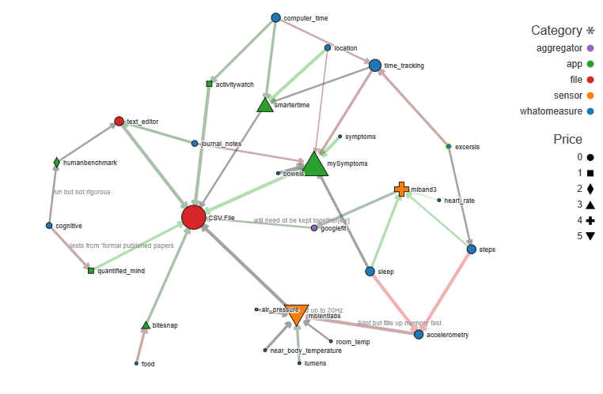

Beginners should read the [Personal Science Wiki](https://wiki.openhumans.org/wiki/Personal_Science_Wiki) where all of the effort that would have gone to this project has gone now.

# QS-data-flow-network-graph
# Network Graph of Quantified Self Health Tracking Ecosystem and Data Flow
Lots of apps and devices are used in QS, biohacking and lifeloging. Public needs a guide. One option for the it's form is an outline with notes, like woop's AwesomeQS. Such an outline can hold any data needed except relationships beyond the first. So I used a dataset. A script can produce outlines from this dataset. Most apps do not export their data in any form and those that do usualy require intermediary programs. Network graphs by netCoin can visualize most data types in one graph (if not many items), especialy the flow of data.

# Personal QS Graph Example

# Instructions
Download zip or file and unpack. Get to netCoin_DataFlow directory and open index.html
Set repulsion (top left) to max.
If too cluttered, user can disable shapes and sizes of nodes in left menues.
To focus on fewer nodes select node of interest and click Egonet or, AddNeighbor then filter connection.

# Description
Edges represent any way to get data from one storage or idea to another; a script, sensor's ablities, user taking test.
Arrows point in direction of data flow. Color describes ease of this step and thickness describes how detailed the data is. 
If a sensor suite detects "steps" then "steps" points to that sensor so if one sense detects another that other points to the first sense. 
Like funnel. For example accelerometry can be used to measure step count and gait.

Each node represents a state. Color describes what kind of state. Size is importance. 
Shape is how much the app or device costs; 
0, the circle, is not available or not applicable.
1 square is Open Source, 2 diamond is free, 3 uptriangle is premium adds few features, 
4 cross is affordable (about 30$), 5 downtriangle is an investment (about 120 per 2 years),
6 circle is expencive (300). 7 square is redonkulous 1000$. Only for labs really.  
Devices may be open source but their category is selected based on buying price.

# Adding Data
It is helpfull if you post a link to a page of an app's integrations to a forum
but learning git and instructions bellow would be more useful.
 
Data is in form of spreadsheets. 
Items added to Connections.csv must include name and category.
To connect and item to others, its best to find an app's page of integrations and add the URL to Automatic_.
Url links should be the entire url with http: .
Connections can be made manualy by inputing exact name of another item into Manual_. Just copy-paste.

I have chosen commas to seperate items inside those lists and semicolon to seperate the cells. 
If saveing from a spreadsheet editor make sure the delimiter is a ;. 
no ; or , inside name or synonym because obv this will split the cell 

Synonyms are used by the auto page reader to find strings in linked pages.
Case and space sensitive. White space matters and is trimmed from ends but not around commas.
Idealy, when used as search string in engine, Names should bring up only relevant pages. 

# Adding Difficulty of Step
Running the main script will automaticaly add a line for each new edge into EdgeUID.csv. 
Lines are removed when connections are removed in main csv. ConnectInGraph is labled as "F" when that link was not used in the graph.
User can edit Aggregation Difficulty Explanation. Weit too if they add [kw] tag to Explanation.
Agg and Diff are rated of a scale of 1 to 5 with 1 being the least complete-thourough and most difficult.
Weit, which brings nodes closer together, is usualy just Agg+Dif but is not being used atm bc of clutter.
 
# Sources
https://forum.quantifiedself.com/t/i-made-a-community-powered-biotracking-tools-list/6715

https://terpconnect.umd.edu/~choe/download/JAMIA-2019-Kim-DataAccessibility.pdf

https://doi.org/10.18710/QXMY88

https://doi.org/10.1186/s12937-018-0366-6

https://forum.quantifiedself.com/t/mapping-qs-data-flows-and-apis/977

https://www.reddit.com/r/QuantifiedSelf/comments/fuagyz/start_here_directories_of_qs_resources/

https://doi.org/10.6084/m9.figshare.9702122

A. Hasan, Handbook of Blood Gas/Acid-Base Interpretation,DOI 10.1007/978-1-4471-4315-4_2, © Springer-Verlag London 2013 chapter 2

https://www.quantifiedbob.com/resources/

https://trackmystack.com/

good devices
https://www.accessdata.fda.gov/scripts/cdrh/cfdocs/cfRL/rl.cfm?start_search=1&establishmentName=&regNum=&StateName=&CountryName=&RegistrationNumber=&OwnerOperatorNumber=10025156&OwnerOperatorName=&ProductCode=&DeviceName=&ProprietaryName=&establishmentType=&PAGENUM=10&SortColumn=
by sensor type
https://www.accessdata.fda.gov/scripts/cdrh/cfdocs/cfStandards/detail.cfm?standard__identification_no=31334
Other ontologies: HL7 MESH ?CE

DARPA_LifeLog ml4qs.org www.2004-2040.com (Neff And Nafus)

https://github.com/woop/awesome-quantified-self

biomindmap.com
